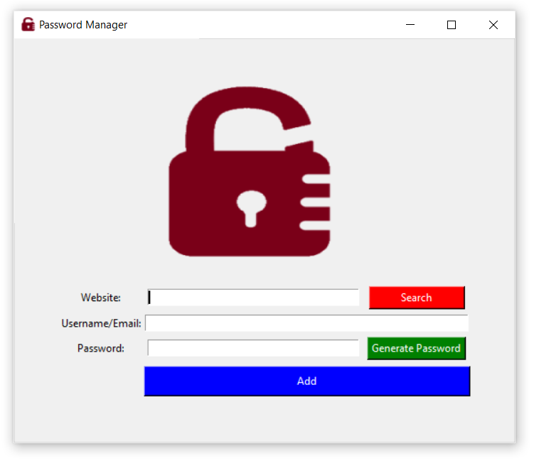

# 🔐 Password Manager – A Simple and Effective Credential Saver

**Password Manager** is a lightweight and beginner-friendly desktop app built with Python and Tkinter.  
It helps you save, generate, and manage your passwords securely — all from a clean and easy-to-use interface.

---

**The Mission:**  
In the age of dozens of accounts and logins, this tool is designed to make your life easier by storing your passwords locally, generating strong ones, and retrieving them in just a few clicks.  
It’s a productivity booster and a first step toward smarter digital security.

---

## 💻 Download for Windows

🔗 [Download Now!](https://github.com/mshikebkhan/password-manager/releases/download/v1.0.0/PasswordManagerSetup.exe)

---

## 🚀 Features

🔒 **Store Passwords** – Save credentials like email, username, and password for any platform  
🔍 **Search Functionality** – Instantly find saved passwords for your accounts  
🔐 **Generate Strong Passwords** – Create complex passwords in one click  
📋 **Auto-Copy to Clipboard** – Generated passwords are copied automatically  
💾 **JSON-based Storage** – All data is saved locally in a `.json` file for simplicity  
🧠 **Beginner-Friendly UI** – Clean, minimal interface for easy use

---

## ⚠️ Security Note

🚨 This version of the Password Manager **does NOT use encryption** and the `.json` file can be accessed directly by anyone who has access to your machine.  
Future updates will include:  
- Password protection on launch  
- Encryption of saved data  
- Option to change master password

> 🧪 You’re welcome to contribute or modify it for better security and new features!

---

## 📸 Screenshots

| Screenshot | Description |
|------------|-------------|
|  | Main Window with fields to enter and search/generate passwords |

---

## 🛠 Tech Stack

- **Language:** Python  
- **GUI:** Tkinter  
- **Storage:** JSON  
- **Clipboard:** pyperclip  
- **Password Generation:** `random`, `string`

---

## ⚙️ Local Setup

```bash
git clone https://github.com/mshikebkhan/password-manager.git
cd password-manager
python -m venv venv
venv\Scripts\activate         # For Windows
pip install -r requirements.txt
python main.py
```
---

## 👥 Contributing

1. Fork the repository
2. Create your feature branch: `git checkout -b feature-name`
3. Commit your changes
4. Push to your branch
5. Open a Pull Request 🚀

---

## 📌 TODO Ideas

- Add password protection to access the app
- Encrypt .json file using a secure algorithm
- Add a master password feature
- Add UI animations or icons for better experience
- Cloud-based syncing (optional advanced feature)
- Or anything else you think of!

---

## 📄 License

[MIT License](LICENSE)

---

Made with ❤️ by Shikeb Khan
